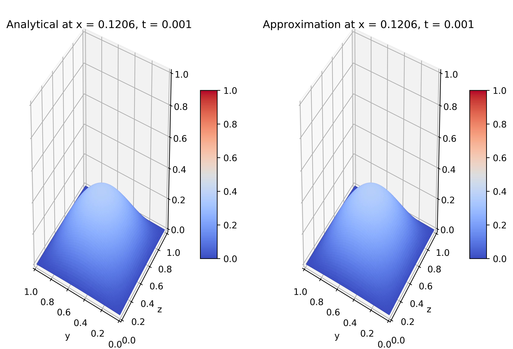
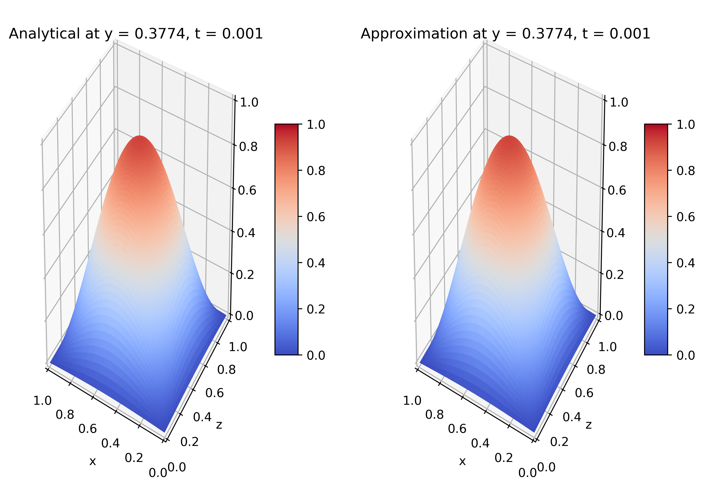
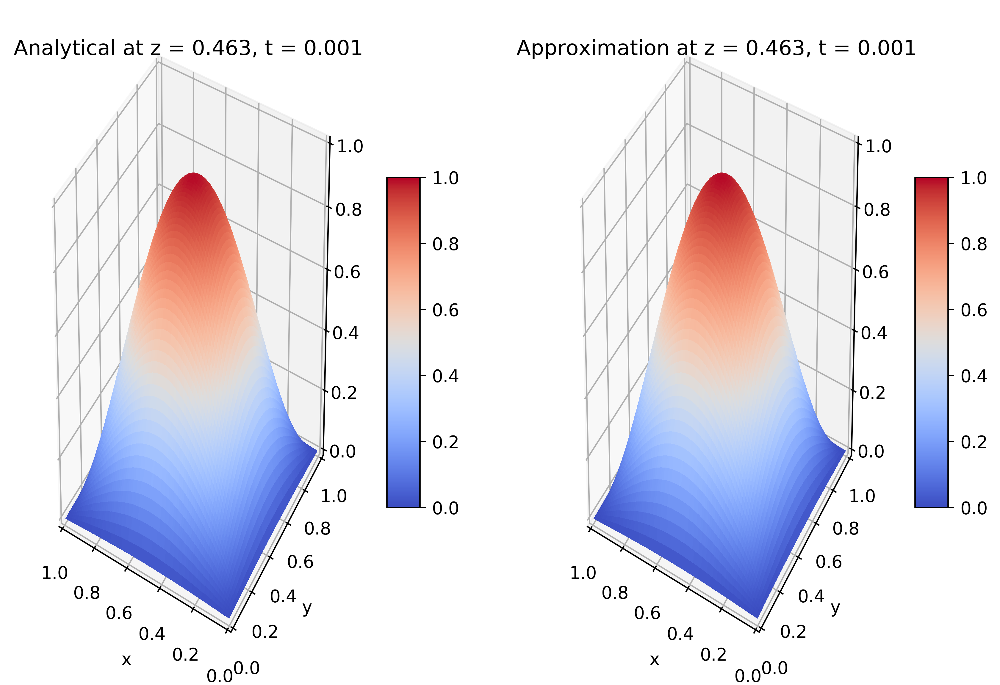
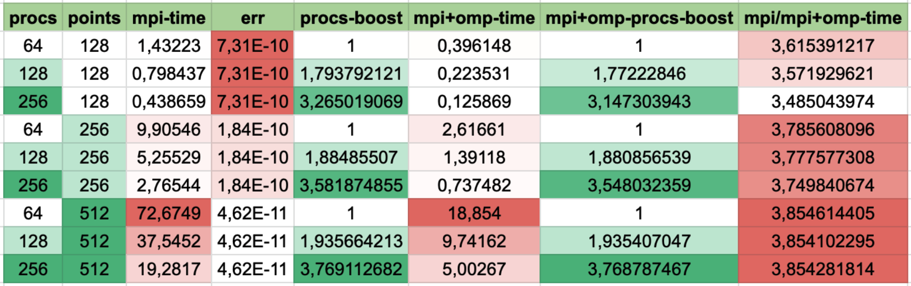
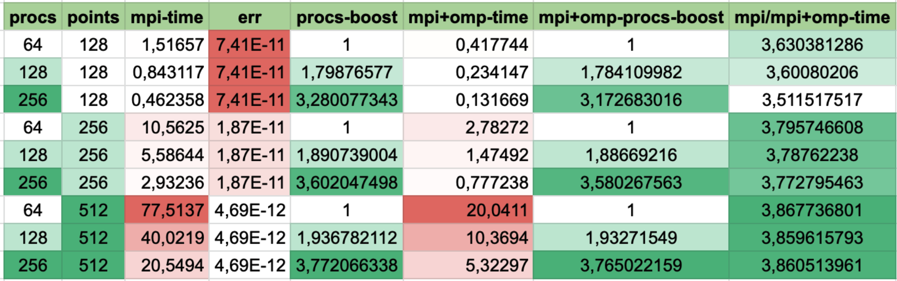
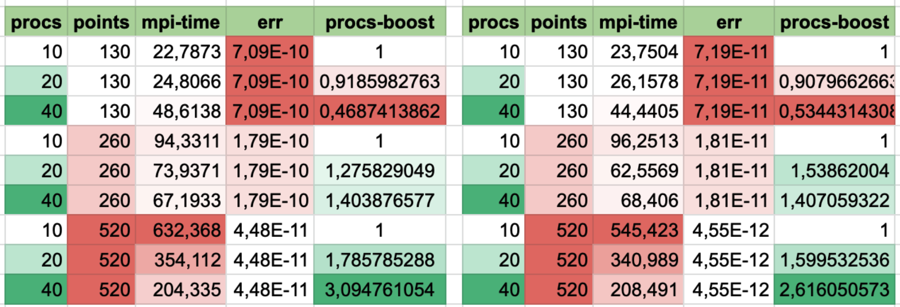

# supercomputers-2020
Данный репозиторий содержит решение задачи численного приближения решения трехмерного гиперболического уравнения в области, представляющей прямоугольный параллелепипед.

Описание задачи представлено в файле [task_description.pdf](https://github.com/davletov-aa/supercomputers-2020/blob/main/task_description.pdf). Задача предлагалась в качестве второго задания по курсу "Суперкомпьютерное моделирование и технологии", читавшегося на факультете ВМК МГУ дла магистрантов второго курса.

### Результаты

#### Blugene: Lx = Ly = Lz = 1

#### Blugene: Lx = Ly = Lz = π

#### Polus: Lx = Ly = Lz = 1 - on the left, Lx = Ly = Lz = π - on the right

